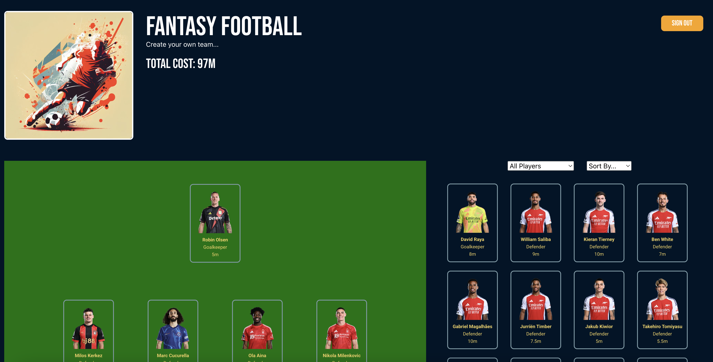
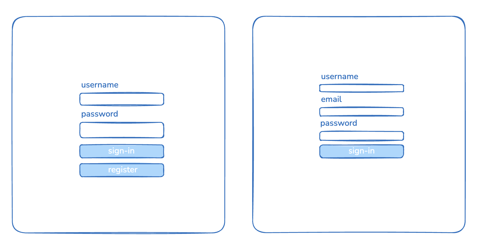
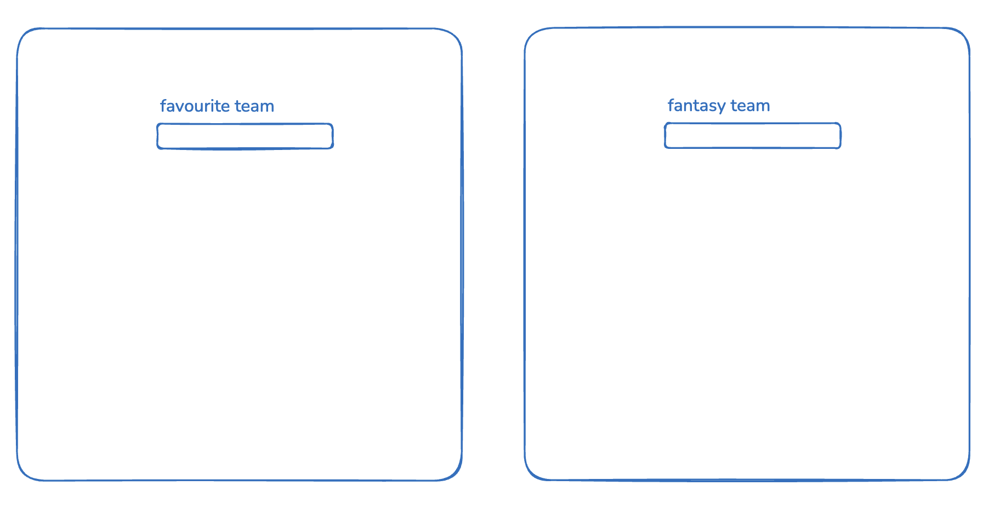
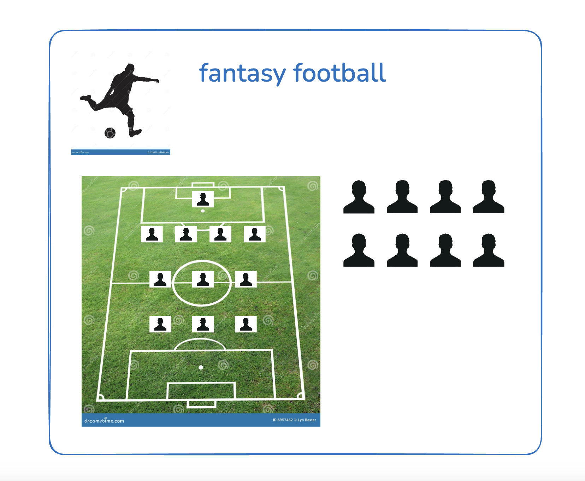
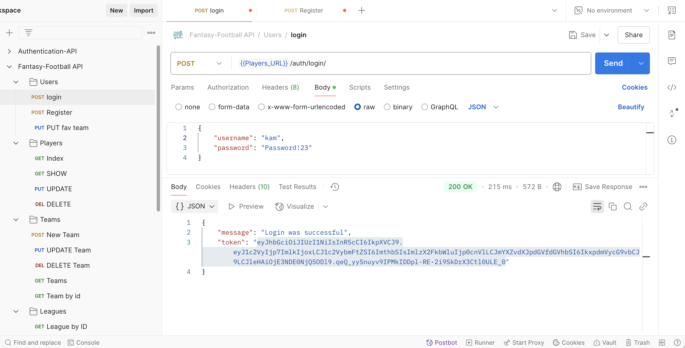
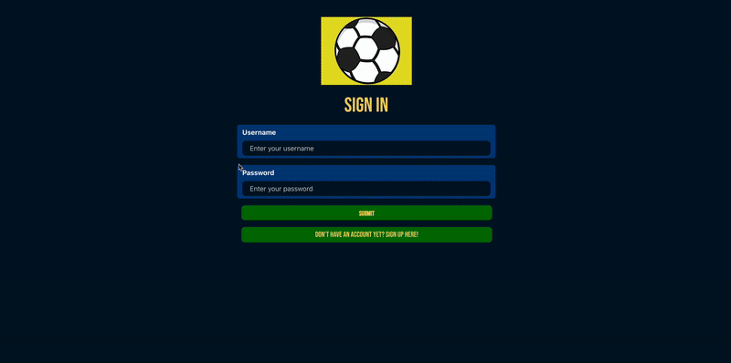

# Fantasy Football App

## **Description**

For the final project we were tasked with building a full-stack application using a Django RESTful API for the back-end and the front-end to be built using React. 

I decided to build a Fantasy Football App. Fantasy football is a game where users create their own team constrained by a transfer budget, selecting players based on their value. Players are awarded points according to their performance and the team score is calculated by the sum of the points of the players selected.

## **Deployment Link**

https://fantasy-football-app.netlify.app/



## **Brief**

For this project, you’ll work across the back-end and the front-end to build a full-stack project using a Django Rest API for the back-end and React for the front-end.

Your app should contain a degree of complexity, which most likely means multiple relationships and CRUD functionality.

On the front-end, your app will use React to create a polished and professional design.

## **Technical requirements**

* Build a full-stack application by making your own backend and your own front-end  
* Use a Python Django API using Django REST Framework to serve your data from a Postgres database  
* Consume your API with a separate front-end built with React  
* Be a complete product which most likely means multiple relationships and CRUD functionality for at least a couple of models  
* Complex Functionality like integrating a 3rd party API or using a particularly complex React Component would mean that the CRUD and multiple relationships requirement can be relaxed, speak to your instructor if you think this could be you.  
* Implement thoughtful user stories/wireframes that are significant enough to help you know which features are core MVP and which you can cut  
* Have a visually impressive design to kick your portfolio up a notch and have something to wow future clients & employers. ALLOW time for this.  
* Be deployed online so it's publicly accessible.


## **Technologies**

Back-End

* Python  
* Django REST  
* PostgreSQL

Front-End

* React				  
* React-Router-Dom  
* React-Bootstrap  
* Axios  
* CORS  
* CSS

Dev Tools

* GitHub  
* Postman  
* TablePlus  
* VS Code  
* Selenium WebDriver

## **Attribution**

<a href="https://fantasy.premierleague.com/" target="_blank"></a>

## **Planning**

When planning the build for the Fantasy Football App, I needed to carefully consider the full scope and functionality of the app. In a typical fantasy football game, users create a team and then enter into a league. However, after evaluating the timeframe, I realised it would be unrealistic to build an app with all the features of a standard fantasy football game. Instead, I decided to focus on a Minimum Viable Product (MVP) that would allow users to create and update their own team. The ability to create and join leagues would remain a stretch goal for future development.

Having established the full scope of the project, I went about creating wireframes, the ERD and a Routing table and posted on the trello board.<br />

 

<br />

<a href="https://trello.com/b/xcIexaB4/fantasy-football" target="_blank"><strong>Trell Board</strong></a>

<a href="https://dbdiagram.io/d/Fantasy-Football-67be534f263d6cf9a074b027" target="_blank"><strong>Entity-Relationship Diagram</strong></a>

<a href="https://docs.google.com/spreadsheets/d/1GnKQcfSqmlHT_jpZLO9gLtrAquTCYDcRGta8swPyaMA/edit?gid=0#gid=0" target="_blank"><strong>Router Table</strong></a>

## **User Story**

* As a visitor on the landing page I see a sign-in button  
* As a visitor I can log-in to my account or create a new account if I don't have one from the sign-in page  
* As a user I can create my own fantasy team  
* As a user I can update my fantasy team  
* As a user I can delete my team  
* As a user I can view individual player profiles  
* Stretch goals \- As a user I can enter my team in a league  
* Stretch goal \- As a user I can join a league  
* Stretch goals \- As an admin user I can create a new league

## **Build/Code Process**

When it came to building the app my first thought and consideration was how I would gather the players data. In order for the game to work in any meaningful way I would need hundreds of player profiles, ideally the players from every premier league club. 

After doing some research, I came across a technique known as Web Scraping. Scraping is where you run a script targeting a website to extract the web page’s content. The HTML content is parsed using a library or tool, and the data is then extracted to the desired format –in this case JSON. I managed to find a script that I was able to adapt to extract the desired player information for each player at every club from the <a href="https://fantasy.premierleague.com" target="_blank">https://fantasy.premierleague.com</a> website. For the script to work I had to install Selenium WebDriver. I had to run the script for each premier league club (20 in total) and added the data to my seed file. I added some fields that would not have been on the web page and were specific to my app, ensuring each player object matched my model. By the end of the process I had player profiles for 470 players.

## **Web Scraping**

```
# Set up Selenium WebDriver
chrome_driver_path = './chromedriver'  # Path to your ChromeDriver executable
service = Service(chrome_driver_path)  # Create a Service object
driver = webdriver.Chrome(service=service)  # Pass the Service object to webdriver.Chrome()

# URL of the Arsenal squad page
url = "https://www.premierleague.com/clubs/38/Wolverhampton-Wanderers/squad?se=719"
# Open the URL
driver.get(url)

# Wait for the page to load completely
time.sleep(10)  # Adjust the sleep time as needed

# Accept cookies
try:
    accept_cookies_button = WebDriverWait(driver, 10).until(
        EC.element_to_be_clickable((By.XPATH, '//button[text()="Accept All Cookies"]'))
    )
    accept_cookies_button.click()
    print("Accepted cookies.")
except Exception as e:
    print("No cookies button found or error clicking it:", e)

# Close the pop-up
try:
    close_popup_button = WebDriverWait(driver, 10).until(
        EC.element_to_be_clickable((By.XPATH, '//button[@class="close"]'))
    )
    close_popup_button.click()
    print("Closed pop-up.")
except Exception as e:
    print("No pop-up found or error closing it:", e)

# Wait for the player cards to load
try:
    WebDriverWait(driver, 20).until(
        EC.presence_of_element_located((By.CLASS_NAME, "stats-card"))
    )
    print("Player cards loaded.")
except Exception as e:
    print("Player cards did not load:", e)
    driver.quit()
    exit(1)

# Get the page source after JavaScript rendering
try:
    page_source = driver.page_source
    if not page_source:
        print("Error: Unable to retrieve the page source.")
        driver.quit()
        exit(1)
except Exception as e:
    print("Error retrieving the page source:", e)
    driver.quit()
    exit(1)

# Print the page source for debugging
print(page_source[:1000])  # Print the first 1000 characters of the page source

# Close the browser
driver.quit()

# Parse the page source with BeautifulSoup
soup = BeautifulSoup(page_source, "html.parser")

# Print the entire HTML content for debugging
print(soup.prettify())

# Find all player cards
player_cards = soup.find_all("li", class_="stats-card")

# Check if player cards were found
if not player_cards:
    print("Error: No player cards found.")
    exit(1)

# Create a directory to save player images
os.makedirs("player_images", exist_ok=True)

# Extract player information
players = []
pk = 1  # Primary key counter
for card in player_cards:
    try:
        # Player name
        first_name = card.find("div", class_="stats-card__player-first").text.strip()
        last_name = card.find("div", class_="stats-card__player-last").text.strip()
        name = f"{first_name} {last_name}"

        # Player position
        position = card.find("div", class_="stats-card__player-position").text.strip()

        # Player image URL
        image_url = card.find("img", class_="statCardImg")["src"]

        # Player stats (appearances, goals, assists, clean sheets)
        appearances = None
        goals = None
        assists = None
        cleansheets = None
        yellowcards = None
        redcards = None
        owngoals = None
        penssaved = None
        points = None
        stats_list = card.find("ul", class_="stats-card__stats-list")
        if stats_list:
            for stat in stats_list.find_all("li", class_="stats-card__row"):
                stat_name = stat.find("div", class_="stats-card__pos").text.strip()
                stat_value = stat.find("div", class_="stats-card__stat").text.strip()
                if stat_name == "Appearances":
                    appearances = int(stat_value)
                elif stat_name == "Goals":
                    goals = int(stat_value)
                elif stat_name == "Assists":
                    assists = int(stat_value)
                elif stat_name == "Clean sheets":
                    cleansheets = int(stat_value)

        # Skip players with 0 appearances
        if appearances == 0 or appearances is None:
            print(f"Skipping player {name} (0 appearances).")
            continue

        # Download the player image
        image_filename = f"player_images/{name.replace(' ', '_')}.jpg"
        with open(image_filename, "wb") as img_file:
            img_file.write(requests.get(image_url).content)

        # Append player data to the list
        players.append({
            "model": "players.players",
            "pk": pk,
            "fields": {
                "image": image_filename,
                "name": name,
                "club": "Wolves",
                "position": position,
                "price": 6,
                "appearances": appearances,
                "goals": goals,
                "assists": assists,
                "cleansheets": cleansheets,
                "yellow_cards": yellowcards,
                "red_cards": redcards,
                "own_goals": owngoals,
                "pens_saved": penssaved,
                "points": points,
            }
        })
        pk += 1  # Increment the primary key counter
    except Exception as e:
        print(f"Error processing player card: {e}")

# Print the extracted player information
for player in players:
    print(player)

# Save the player data to a JSON file
with open("arsenal_squad.json", "w") as json_file:
    json.dump(players, json_file, indent=4)

print("Player data and images have been extracted and saved.")
```

Having tested and tweaked the script to suit my data requirements I scraped a sample of (Arsenal) players and proceeded with the build of my Django REST API, creating a GitHub repository and the files and installing dependencies.

Once I had completed the initial set-up I moved on to my user model, migrating and creating a superuser. After that I moved on to the players model, followed by the teams  model and finally the league model, adding each to my Installed Apps list. Although the league feature is a stretch goal I thought it wise to include it in the back-end for future development.

Having completed the models I moved on to the views for the user, creating a serializer and a view for Logging-in and Registering. I then repeated the process for the players model, followed by the teams model and the league model. I set up the models referring to my ERD, designating ForeignKey and ManyToManyField to the appropriate fields. 

A Json file with the players data was seeded onto the Django database. For user authentication I used JSON Web Tokens (JWT) method, returning a token for an authenticated user. 

## **User Authentication**

```
class JWTAuthentication(BaseAuthentication):
    def authenticate(self, request):
        if not request.headers:
            return None

        auth_header = request.headers.get('Authorization')
        if not auth_header:
            return None

        if not auth_header.startswith('Bearer'):
            raise AuthenticationFailed('Auth header not a valid bearer token')

        token = auth_header.replace('Bearer ', '')

        try:
            payload = jwt.decode(
                token,
                settings.SECRET_KEY,
                algorithms=['HS256']
            )
            print('payload', payload)

            user = User.objects.get(id=payload['user']['id'])

            return (user, token)
        except Exception as e:
            print(e)
            raise AuthenticationFailed('Token not valid')
```
<br />

After all the models and views were completed, all CRUD operations were thoroughly tested utilising Postman and the Django Admin site. 

<br />

Having completed and tested the back-end API, I moved onto the front-end, creating a GitHub repo and a Vite-React project folder. Having installed react-router and imported BrowserRouter I set up the main.jsx file to render the application and set up the routes for registering and signing-in. 

For my app I decided the homepage would be the sign-in page and that would include a button that navigates the user to register an account if they don’t already have one. I created an auth.js file to manage the JWT from the browser’s local storage, creating functions to set, get and remove the token. And also set an expiry of 24 hours for the token and retrieve the user information from it.

```
export const setToken = (token) => {
  localStorage.setItem(tokenName, token)
}

export const getToken = () => {
  return localStorage.getItem(tokenName)
}

export const removeToken = () => {
  localStorage.removeItem(tokenName)
}

/**
 * This function decodes the token payload, checks if the token is expired,
 * and returns the user object if the token is valid.
 * @returns {object|null} - The user object if the token is valid, otherwise null.
 */
export const getUserFromToken = () => {
  // 1. Get the token from storage
  const token = getToken()

  // 2. If there's no token, return null as no user exists
  if (!token) return null

  // 3. Decode the payload from the token
  const payload = JSON.parse(atob(token.split('.')[1]))

  // 4. Compare current time with expiry to check validity
  if (payload.exp < Date.now() / 1000) {
    // Remove the token from storage if expired
    removeToken()
    // Return null as no valid user is present
    return null
  }

  // 5. Return the user from the payload
  return payload.user;
}
```

In the Sign-in component I set up a form that on submission, it sets the token and navigates the user to the fantasy-team-name page if they haven’t already created one and to the select-team page if they have. However, there is also a button that navigates the user to the sign-up page if they do not already have an account. The Sign-up component is similarly set-up and on submission automatically signs-in the user and takes them to their favourite-team page. 

```
const handleNavigate = (existingTeam) => {
        user.favourite_team && existingTeam ? navigate('/selectteam') : user.favourite_team ? navigate('/fantasyteamname') : navigate('/favouriteteam')
    }
```

```
<button onClick={() => navigate('/signup')} className={styles.button}>Don't have an account yet? Sign up here!</button>
```

I made sure validation errors were added to both the Sign-in and Sign-up pages. Once the Sign-in and Sign-up components were completed, I moved on to the Favourite-Team and Fantasy-Team-Name components. The favourite-team page displays the club crests for each Premier League club and requires the user to select their favourite team by clicking on the button. This is then stored in the user’s profile. The fantasy-team-name page prompts the user to create a name for their fantasy team. This posts a team for that user, NB: at this stage the team only has a name and the players still need to be selected, which will effectively be a PUT method from the team-select page.

```
const handleTeamSelect = async (e) => {
  const favourite_team = e.currentTarget.value
  try {
    const updatedUser = await updateProfile({ favourite_team })
    setUser(updatedUser)
    navigate('/fantasyteamname')
  } catch (error) {
    console.error('Error updating profile:', error)
  }
}
```

```
const handleSubmit = async (e) => {
  e.preventDefault()
  try {
    const teamName = await teamPost(teamData)
    setToken(data.token)
    setUser(getUserFromToken())
    setTeamData(teamName)
  } catch (error) {
    console.error('Error submitting team data:', error)
  }
}
```

## 🎬 Registering Account and Creating Fantasy Team



After creating a team name the user arrives at the select-team page or rather the SelectTeam component. The bulk of the complex functionality is built in this component, including fetching the players index and adding and removing players from the team. The basic concept is that clicking on a player button selects that player and adds it to the team, or rather updates the team state and adds that player to the vacant position in the Pitch component.

```
displayedPlayers.map(player => (
  <button
    key={player.id}
    onClick={() => handleAddPlayer(player)}
    className={styles.playerButton}
    disabled={pickedPlayers.includes(player.id)}
  >
    <PlayerCard player={player} />
  </button>
))
```

```
const handleAddPlayer = (player) => {
    if (player.position === 'Goalkeeper') {
        setTeamData(prevState => ({ ...prevState, goalkeeper: player.id }))
    } else if (player.position === 'Defender') {
        setTeamData(prevState => {
            const newDefenders = [...prevState.defenders]
            const index = newDefenders.findIndex(defender => defender === null)
            if (index !== -1) newDefenders[index] = player.id
            return { ...prevState, defenders: newDefenders }
        })
    } else if (player.position === 'Midfielder') {
        setTeamData(prevState => {
            const newMidfielders = [...prevState.midfielders]
            const index = newMidfielders.findIndex(midfielder => midfielder === null)
            if (index !== -1) newMidfielders[index] = player.id
            return { ...prevState, midfielders: newMidfielders }
        })
    } else if (player.position === 'Forward') {
        setTeamData(prevState => {
            const newForwards = [...prevState.forwards]
            const index = newForwards.findIndex(forward => forward === null)
            if (index !== -1) newForwards[index] = player.id
            return { ...prevState, forwards: newForwards }
        })
    }
}
```

Likewise clicking on the player on the Pitch de-selects the player or rather updates the team state removing the player.

```
<div className={styles.pitch}>
    <div className={styles.pitchGoalkeeper}>
        {teamData.goalkeeper ? 
            <button onClick={() => handleRemovePlayer('Goalkeeper')} className={styles.vacantButton} disabled={isSaved}>
                <PlayerCard player={getPlayerById(teamData.goalkeeper)} />
            </button> 
            : <VacantPlayer position={"Goalkeeper"} disabled={true} />}
    </div>
    <div className={styles.pitchDefenders}>
        {teamData.defenders.map((defender, index) => (
            defender ? 
                <button key={index} onClick={() => handleRemovePlayer('Defender', index)} className={styles.vacantButton} disabled={isSaved}>
                    <PlayerCard player={getPlayerById(defender)} />
                </button> 
                : <VacantPlayer key={index} position={"Defender"} disabled={true} />
        ))}
    </div>
    <div className={styles.pitchMidfielders}>
        {teamData.midfielders.map((midfielder, index) => (
            midfielder ? 
                <button key={index} onClick={() => handleRemovePlayer('Midfielder', index)} className={styles.vacantButton} disabled={isSaved}>
                    <PlayerCard player={getPlayerById(midfielder)} />
                </button> 
                : <VacantPlayer key={index} position={"Midfielder"} disabled={true} />
        ))}
    </div>
    <div className={styles.pitchForwards}>
        {teamData.forwards.map((forward, index) => (
            forward ? 
                <button key={index} onClick={() => handleRemovePlayer('Forward', index)} className={styles.vacantButton} disable={isSaved}>
                    <PlayerCard player={getPlayerById(forward)} />
                </button> 
                : <VacantPlayer key={index} position={"Forward"} disabled={true} />
        ))}
    </div>
</div>
```

```
const handleRemovePlayer = (position, index) => {
    setTeamData(prevState => {
        if (position === 'Goalkeeper') {
            return { ...prevState, goalkeeper: null }
        } else if (position === 'Defender') {
            const newDefenders = [...prevState.defenders]
            newDefenders[index] = null
            return { ...prevState, defenders: newDefenders }
        } else if (position === 'Midfielder') {
            const newMidfielders = [...prevState.midfielders]
            newMidfielders[index] = null
            return { ...prevState, midfielders: newMidfielders }
        } else if (position === 'Forward') {
            const newForwards = [...prevState.forwards]
            newForwards[index] = null
            return { ...prevState, forwards: newForwards }
        }
    })
}
```

If a user already has a saved team then when they sign-in it should take them to the select-team page, and the page should load with the make-up of their team already selected. This meant fetching all teams and finding the team with the same user id and setting that team to iniltializeTeamData.

```
useEffect(() => {
    teamIndex()
        .then(data => {
            setAllTeams(data)
        })
        .catch(err => console.log(err))
        .finally(() => setIsLoading(false))
}, [])

useEffect(() => {
    if (allTeams.length > 0) {
        const team = allTeams.find(team => team.user === user.id)
        if (team) {
            setCurrentTeam(team)
            teamShow(team.id)
                .then(data => {
                    setTeamData(initializeTeamData(data))
                })
                .catch(err => console.log(err))
        } else {
            console.log("No team found for user")
        }
    }
}, [allTeams, user.id])

useEffect(() => {
    if (existingTeam) {
        setTeamData(initializeTeamData(existingTeam))
    }
}, [existingTeam])
```

## 🎬 Updating Saved Team


The players index has filtering and sorting functionality. Users can filter players by their position or club and sort players by their total points or price.

```
useEffect(() => {
    let results = players

    if (filterBy === 'Goalkeepers') {
        results = results.filter(player => player.position === 'Goalkeeper')
    } else if (filterBy === 'Defenders') {
        results = results.filter(player => player.position === 'Defender')
    } else if (filterBy === 'Midfielders') {
        results = results.filter(player => player.position === 'Midfielder')
    } else if (filterBy === 'Forwards') {
        results = results.filter(player => player.position === 'Forward')
    } else if (filterBy !== 'All') {
        results = results.filter(player => player.club === filterBy)
    }

    if (sortBy === 'totalPoints') {
        results.sort((a, b) => b.points - a.points)
    } else if (sortBy === 'price') {
        results.sort((b, a) => a.price - b.price)
    }

    setDisplayedPlayers(results)

}, [filterBy, players, sortBy])
```

## 🎬 Filtering/Sorting Players Index


The SelectTeam component consists of a host of components that contain logic pertaining to filtering/sorting the players index, composing the team on the pitch, saving and deleting the team.

## **Challenges**

The main challenges in the project revolved around implementing the functionality for adding, removing and displaying selected players as well as updating the team state with these players. Another significant challenge was loading a user’s existing team from the database and ensuring it rendered correctly in the frontend.

## **Wins**

* ‘Scraping’ \- running a script to gather all the players data.  
* Implementing user authentication \- this was something I was not given the opportunity to do in the last team project.  
* Filtering and Sorting the players data.  
* Using buttons to handle adding and removing players from the team.  
* Selected players displaying on the pitch.  
* The user’s existing team loads when they return to the site.  
* First back-end app built using Django.

## **Key Learnings/Takeaways**

This being my first Django RESTful API was a valuable experience. It deepened my understanding of Django and PostgreSQL for building relational databases. These technologies proved far more effective and adept at handling relations across multiple models compared to my previous experience with Express. Additionally, this project provided another opportunity to work with React, further solidifying my knowledge and boosting my confidence.

The scale and scope of the project were quite daunting to begin with, but breaking each problem down into bite-sized chunks and–dare I say it ‘components’, made the process much more manageable.

## **Bugs**

There is a bug where, if a player’s name wraps across two lines, the text overlaps. This issue only affects a small number of players and has been fixed with a work-around by updating the database with shorter names.

## **Future Improvements**

There are many features I can add to this app to enhance the user experience. Firstly the user experience would be greatly improved if I added a scroll bar or pagination to the players index. In the future I would like to add the ability to create and join leagues. I would also like to add a pop-up that displays the complete player profile.
